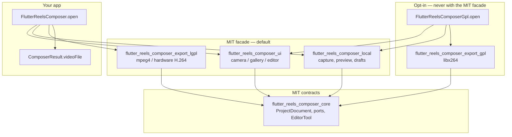

# Flutter Reels Composer

[](https://github.com/alaeddine-zen/flutter_reels_composer/actions/workflows/ci.yml)
[](LICENSE)
[](packages/flutter_reels_composer_gpl/LICENSE)
[](#requirements)
[](#requirements)
[](#requirements)

Drop-in TikTok/Snap-style **camera → editor → export** for Flutter.

The composer owns capture, gallery import, editing, preview, drafts, and
export. Your app owns authentication, upload, CDN, moderation, and publishing.

> **Status.** Version **0.2.0** is developed in this monorepo. Packages are
> **not yet published on pub.dev**. Install from Git or a local path until they
> are. Internal `pubspec.yaml` files already declare hosted `^0.2.0`
> dependencies; `pubspec_overrides.yaml` rewires them to local paths.

## Screenshots

Product screenshots are not in the repository yet. Drop PNG/WebP files into
[`docs/images/`](docs/images/) using these names, then replace this section:

| Camera | Editor | Export |
| --- | --- | --- |
| `docs/images/camera.png` | `docs/images/editor.png` | `docs/images/export.png` |

## Quick start

**1. Add the MIT facade** (Git, until pub.dev):

```yaml
dependencies:
  flutter_reels_composer:
    git:
      url: https://github.com/alaeddine-zen/flutter_reels_composer.git
      path: packages/flutter_reels_composer
      ref: main

# Required until the packages are on pub.dev: internal deps are hosted ^0.2.0.
dependency_overrides:
  flutter_reels_composer_core:
    git:
      url: https://github.com/alaeddine-zen/flutter_reels_composer.git
      path: packages/flutter_reels_composer_core
      ref: main
  flutter_reels_composer_ui:
    git:
      url: https://github.com/alaeddine-zen/flutter_reels_composer.git
      path: packages/flutter_reels_composer_ui
      ref: main
  flutter_reels_composer_local:
    git:
      url: https://github.com/alaeddine-zen/flutter_reels_composer.git
      path: packages/flutter_reels_composer_local
      ref: main
  flutter_reels_composer_export_lgpl:
    git:
      url: https://github.com/alaeddine-zen/flutter_reels_composer.git
      path: packages/flutter_reels_composer_export_lgpl
      ref: main
```

After publish, this becomes `flutter_reels_composer: ^0.2.0` with no overrides.

**2. Declare permissions** — see [Permissions](#permissions) and
[`docs/permissions.md`](docs/permissions.md).

**3. Open the composer:**

```dart
import 'package:flutter_reels_composer/flutter_reels_composer.dart';

final result = await FlutterReelsComposer.open(
  context,
  config: ComposerConfig(
    theme: const ComposerTheme(accent: Color(0xFFFF2D55)),
    maxDuration: const Duration(seconds: 60),
  ),
);

if (result != null) {
  // result.videoFile  → upload pipeline
  // result.coverFile  → optional JPEG cover
  // result.duration   → baked timeline length
  // result.project    → sanitized ProjectSnapshot JSON
}
```

`null` means the user cancelled. The plugin does not upload.

Try the bundled host: [`example/`](example/).

## Features

| Area | What ships in 0.2.0 |
| --- | --- |
| Capture | Camera recording (front/back), countdown, record presets 15 / 30 / 60 s |
| Import | Gallery videos and photos (`photo_manager`); photos become `ImageClip` stills (3 s, no FFmpeg at import) |
| Timeline | Multi-clip, trim / roll handles, split, snap, zoom, dip-to-black fade |
| History | Undo / redo (`ComposerController.apply` / `applyLive`, Ctrl/Cmd+Z) |
| Look | Color filters (bundled + host `EffectCatalog`); preview = export `ColorGrade` |
| Overlays | Draggable / rotatable text layers; RTL via `textLooksRtl` |
| Audio | Music catalog + device audio; original + music mix |
| Captions | Pluggable `CaptionEngine` (default is a no-op) |
| Templates | Bundled JSON catalog, overridable |
| Duet | Split or picture-in-picture when `parentVideoPath` + `duetLayout` are set |
| Drafts | `FileDraftStore`; editor autosave every 8 s (`autosaveInterval`) |
| Export | LGPL FFmpeg: **mpeg4** default, optional hardware H.264; quality chips 480 / 720 / 1080; canvas **cover** matches preview |
| Extensibility | `EditorTool`, `ComposerEngine`, `ExportPort`, catalogs, theme, l10n |

Built-in editor tool ids: `trim`, `filter`, `text`, `audio`, `cover`, `speed`,
`captions`, `templates`. Features `stickers`, `beauty`, `arMasks`, and
`greenScreen` exist as capability gates for **host tools** — they are not
bundled implementations.

## Architecture



Export is **not** part of `ComposerEngine`. Swap FFmpeg for a cloud or native
`ExportPort` without forking the UI.

## Packages

| Package | Role | License |
| --- | --- | --- |
| [`flutter_reels_composer`](packages/flutter_reels_composer) | Batteries-included facade `FlutterReelsComposer.open` | MIT + bundled LGPL FFmpeg |
| [`flutter_reels_composer_core`](packages/flutter_reels_composer_core) | Domain, contracts, mutations, tools | MIT |
| [`flutter_reels_composer_ui`](packages/flutter_reels_composer_ui) | Camera, gallery, editor UI | MIT |
| [`flutter_reels_composer_local`](packages/flutter_reels_composer_local) | Capture, gallery picker, preview, `FileDraftStore` | MIT |
| [`flutter_reels_composer_export_lgpl`](packages/flutter_reels_composer_export_lgpl) | FFmpeg via `ffmpeg_kit_flutter_new_min` | MIT + FFmpeg LGPL |
| [`flutter_reels_composer_export_gpl`](packages/flutter_reels_composer_export_gpl) | FFmpeg via `ffmpeg_kit_flutter_new_min_gpl` (`libx264`) | GPL-3.0 |
| [`flutter_reels_composer_gpl`](packages/flutter_reels_composer_gpl) | Batteries-included facade `FlutterReelsComposerGpl.open` | GPL-3.0 |

The workspace root is documentation-only (`publish_to: none`).

## Public API

Stable host surface (MIT façade, also on the GPL façade with `Gpl.open`):

- `FlutterReelsComposer.open()`
- `ComposerConfig` (catalogs, theme, l10n, ports, `extraTools`)
- `EditorTool` / `defaultEditorTools`
- `ComposerNavigator`

`CameraPage`, `GalleryPage`, and `EditorPage` are **not** exported from
`flutter_reels_composer`, `flutter_reels_composer_gpl`, or
`package:flutter_reels_composer_ui/flutter_reels_composer_ui.dart`. Custom
shells import `package:flutter_reels_composer_ui/pages.dart`.

## LGPL vs GPL — read this before shipping

The default facade **does not use libx264**. LGPL FFmpeg encodes with:

| Codec | When |
| --- | --- |
| `mpeg4` (MPEG-4 Part 2) | Default. Available on every supported device. |
| `h264_videotoolbox` | Opt-in hardware H.264 on iOS |
| `h264_mediacodec` | Opt-in hardware H.264 on Android |

```dart
ComposerConfig(
  exporter: FfmpegLgplExportPort(
    videoCodec: FfmpegLgplVideoCodec.hardwareH264,
  ),
)
```

For software **x264** (`libx264`), depend on `flutter_reels_composer_gpl` and
call `FlutterReelsComposerGpl.open`. That package is **GPL-3.0**. Distributing
it typically makes the **entire application** a GPL work. Review obligations
with counsel.

**Never combine the two facades in one app.** They pull mutually exclusive
FFmpeg Kit binaries (`ffmpeg_kit_flutter_new_min` vs
`ffmpeg_kit_flutter_new_min_gpl`). Do not add `flutter_reels_composer_gpl` or
`flutter_reels_composer_export_gpl` next to `flutter_reels_composer`.

Shipping the LGPL adapter still requires LGPL compliance (dynamic linking /
object-file offer as applicable). See
[`docs/licensing.md`](docs/licensing.md) and
[`packages/flutter_reels_composer_export_lgpl/THIRD_PARTY_NOTICES.md`](packages/flutter_reels_composer_export_lgpl/THIRD_PARTY_NOTICES.md).

## Requirements

- Dart SDK `>=3.8.0 <4.0.0`
- Flutter `>=3.32.0`
- **Android and iOS only** (no web, macOS, Windows, or Linux)
- Camera, microphone, and photo-library permissions (below)

Honor each native plugin’s `minSdk` / iOS deployment target (`camerawesome`,
`photo_manager`, `ffmpeg_kit_flutter_new_min`, `permission_handler`).

## Permissions

### Android

Declare in `AndroidManifest.xml` (see [`example/android/app/src/main/AndroidManifest.xml`](example/android/app/src/main/AndroidManifest.xml)):

```xml
<uses-permission android:name="android.permission.CAMERA" />
<uses-permission android:name="android.permission.RECORD_AUDIO" />
<uses-permission android:name="android.permission.READ_MEDIA_VIDEO" />
<uses-permission android:name="android.permission.READ_MEDIA_IMAGES" />
<uses-permission android:name="android.permission.READ_MEDIA_AUDIO" />
<uses-permission android:name="android.permission.READ_EXTERNAL_STORAGE"
    android:maxSdkVersion="32" />
```

Runtime prompts are handled by `permission_handler` / `photo_manager`.

### iOS

Add usage strings to `Info.plist` (see [`example/ios/Runner/Info.plist`](example/ios/Runner/Info.plist)):

```xml
<key>NSCameraUsageDescription</key>
<string>The app uses the camera to record Reels.</string>
<key>NSMicrophoneUsageDescription</key>
<string>The app uses the microphone to record Reels.</string>
<key>NSPhotoLibraryUsageDescription</key>
<string>The app accesses photos and videos to import Reels.</string>
<key>NSPhotoLibraryAddUsageDescription</key>
<string>The app may save exported Reels to your library.</string>
```

**Swift Package Manager (default for recent Flutter):** `permission_handler`
enables camera, microphone, and photos from those usage-description keys. The
example app uses SPM and has **no Podfile**.

**CocoaPods hosts** must still set preprocessor macros in the `Podfile`:

```ruby
post_install do |installer|
  installer.pods_project.targets.each do |target|
    flutter_additional_ios_build_settings(target)
    target.build_configurations.each do |config|
      config.build_settings['GCC_PREPROCESSOR_DEFINITIONS'] ||= [
        '$(inherited)',
        'PERMISSION_CAMERA=1',
        'PERMISSION_MICROPHONE=1',
        'PERMISSION_PHOTOS=1',
        'PERMISSION_PHOTOS_ADD_ONLY=1',
      ]
    end
  end
end
```

Details: [`docs/permissions.md`](docs/permissions.md).

## Configuration

`ComposerConfig` is the host integration surface. Full field list:
[`docs/api/composer-config.md`](docs/api/composer-config.md).

```dart
FlutterReelsComposer.open(
  context,
  config: ComposerConfig(
    theme: const ComposerTheme(accent: Color(0xFFFF2D55)),
    maxDuration: const Duration(seconds: 60),
    recordPresets: const [
      Duration(seconds: 15),
      Duration(seconds: 30),
      Duration(seconds: 60),
    ],
    locale: const Locale('fr'), // bundled: en, fr, ar
    musicCatalog: MusicCatalog(tracks: [
      MusicTrack(
        id: 'beat_1',
        title: 'Night Drive',
        artist: 'Catalog',
        sourcePath: '/path/to/audio.m4a',
      ),
    ]),
    effectCatalog: const EffectCatalog(effects: []),
    templateCatalog: TemplateCatalog.bundled,
    extraTools: [MyStickerTool()],
    captionEngine: MyWhisperEngine(),
    enabledFeatures: kDefaultV1Features,
    parentVideoPath: parentPath,   // duet
    duetLayout: DuetLayout.split,  // or DuetLayout.pip
    onEvent: (e) => analytics.track(e.type.name, e.properties),
  ),
);
```

| Knob | Default | Notes |
| --- | --- | --- |
| `theme` | `ComposerTheme.snapTikTok` | Dark Material 3; override `accent`, sizes, etc. |
| `locale` / `l10n` | Host `Localizations` or English | Implement `ComposerToolL10n` to replace every string |
| `musicCatalog` | Empty | Host supplies licensed audio paths |
| `effectCatalog` | Empty | Merged on top of the bundled effects pack |
| `templateCatalog` | Bundled JSON, then `TemplateCatalog.bundled` | Pass a non-empty catalog to replace |
| `extraTools` | `[]` | Same `id` replaces a built-in tool |
| `captionEngine` | `NullCaptionEngine` | Without a real engine, Generate returns no cues |
| `exporter` | `FfmpegLgplExportPort()` | Inject any `ExportPort` |
| `draftStore` | `FileDraftStore()` | Or `MemoryDraftStore` / custom |
| `autosaveInterval` | 8 s | `Duration.zero` disables periodic draft flush |
| `enabledFeatures` | `kDefaultV1Features` | Intersected with engine capabilities |

Host `extraTools` stay visible even when the local engine does not advertise
their `ComposerFeature`.

## Example

```bash
git clone https://github.com/alaeddine-zen/flutter_reels_composer.git
cd flutter_reels_composer/example
flutter pub get
flutter run
```

`example/pubspec_overrides.yaml` points at the local packages. Camera,
microphone, and photo library strings are already in the native projects.
Walkthrough: [`example/README.md`](example/README.md).

## FAQ

**Can I depend on both `flutter_reels_composer` and `flutter_reels_composer_gpl`?**
No. Mutually exclusive FFmpeg Kit builds.

**Why is the default encoder MPEG-4, not H.264?**
`libx264` is GPL. The LGPL adapter uses FFmpeg’s native `mpeg4` encoder, or
platform hardware H.264 when you set `FfmpegLgplVideoCodec.hardwareH264`.

**Are packages on pub.dev?**
Not yet. Use Git or path dependencies. After publish, depend on `^0.2.0`.

**Does this work on web or desktop?**
No. Android and iOS only.

**Where do drafts live?**
`FileDraftStore` writes under `getApplicationSupportDirectory()/reels_composer_drafts`.

**Why are captions empty?**
The default `NullCaptionEngine` returns `[]`. Inject a `CaptionEngine`.

**Can I skip FFmpeg entirely?**
Yes. Implement `ExportPort` (and usually `StillImageEncoderPort` +
`FrameExtractorPort`) and pass them on `ComposerConfig`.

**Can I build a custom shell?**
Yes. Depend on `core` + `ui` + `local` (or your engine). Prefer
`ComposerNavigator` from the UI barrel. To assemble screens yourself:

```dart
import 'package:flutter_reels_composer_ui/pages.dart';
```

That library exports `CameraPage`, `GalleryPage`, and `EditorPage`. They are
not on the MIT/GPL façades or the main UI barrel.

## Documentation

- [Getting started](docs/getting-started.md)
- [Architecture](docs/architecture.md)
- [Performance](docs/performance.md)
- [Extensibility](docs/extensibility.md)
- [ComposerConfig API](docs/api/composer-config.md)
- [Permissions](docs/permissions.md)
- [Licensing / FFmpeg](docs/licensing.md)
- [Customization](docs/customization.md)
- [Editor tools](docs/extensions/editor-tools.md)
- [Custom engines](docs/extensions/engines.md)
- [Migration notes](docs/migration/v1-to-v2.md)
- [Publishing to pub.dev](docs/publishing.md)
- [Contributing](CONTRIBUTING.md)
- [Security](SECURITY.md)
- [Code of conduct](CODE_OF_CONDUCT.md)
- [Changelog](CHANGELOG.md)

## License

- Repository root and MIT packages: [MIT](LICENSE)
- `flutter_reels_composer_gpl` and `flutter_reels_composer_export_gpl`: [GPL-3.0-only](packages/flutter_reels_composer_gpl/LICENSE)
- FFmpeg binaries: LGPL or GPL depending on the adapter you ship
